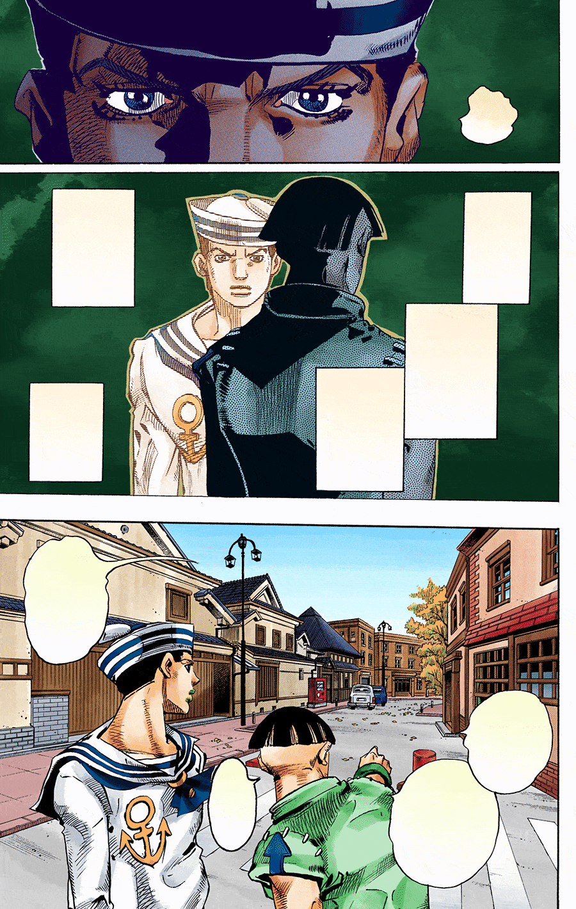
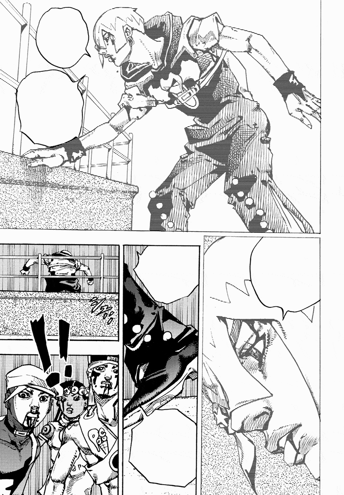

# Auto Insert Txt to Comic

A Photoshop script that partially automates manga/comic typesetting. It reads a formatted translation `.txt` and places every line into your `.psd`/`.psb` pages, already styled, sized, centered and sorted into a `Text` group. Lines are placed using OCR coordinates from [PanelCleaner](https://github.com/VoxelCubes/PanelCleaner), or on a fallback grid.

Inspired by the original [Insert Txt to Comic](https://github.com/pespositotlr/insert-txt-text-to-comic/) script. Auto-centering code based on [TypeR](https://github.com/ScanR/TypeR).

<p align="center">
  
  
</p>

## Installation

1. Place `Auto Insert Txt to Comic.jsx` in Photoshop's Scripts folder:
   - **PC:** `C:\Program Files\Adobe\Adobe Photoshop <version>\Presets\Scripts\`
   - **Mac:** `/Applications/Adobe Photoshop <version>/Presets/Scripts/`
2. Restart Photoshop.
3. Run it via **File > Scripts > Auto Insert Txt to Comic**.

## Quick start

1. Run the script and pick a style set (or load your own JSON, see [Text styles](#text-styles)).
2. (Optional) Make an OCR `.csv` of your pages with [PanelCleaner](https://github.com/VoxelCubes/PanelCleaner) (its page explains how) and select it for precise bubble placement.
3. Select the `.psd`/`.psb` pages to typeset.
4. Select the translation `.txt`.
5. The script opens each page, inserts the text, saves and closes. Press **Esc** to stop (the page in progress is closed without saving). If anything doesn't match, a log file is written next to your PSDs.

[Here you can find a sample folder so you know what's the "setup"](https://files.catbox.moe/y2rav0.zip)

## Features

**Smart Sizing**: text size scales with character count. Short yells like "Ah!" get the max size, long dialogue shrinks toward the minimum. Tune `MAX_PT`, `MIN_PT`, `MIN_CHAR` and `MAX_CHAR` at the top of the script. It's a fallback for styles without a hardcoded size; "Force Smart Sizing" overrides hardcoded sizes too.

**Markdown-like styling**: asterisks in the txt switch font variants mid-sentence:
- `*one*` = Italic (looks for the `-Italic` font variant)
- `**two**` = Bold (`-Bold`)
- `***three***` = Bold Italic (`-BoldItalic`), plus the same dark red as quotes on color pages (set `MARKDOWN_BOLDITALIC_RED` to `false` to turn that off)

Only asterisks that form a real span count as markup. Everything else stays as literal text, so censorship and note markers survive:
- runs of 4+ asterisks are never markup (`****Tok`)
- an asterisk with no partner stays (`Pachinko*`)
- opener and closer must match in length and hug the text (`* x *` and `5 * 3 * 2` are left alone)
- nesting (`**bold *and italic* bold**`) is not supported

**Quote styling**: text inside quotes (`"..."`, `“...”`, `«...»`, and `'...'` ending in punctuation) gets Bold Italic, plus a dark red on color pages when the text color isn't near-black or near-white. It can also strip the quote marks after styling.

**Keep Tags**: speaker tags listed in this field (default: `N/T, T/N, Note, Nota`) are pasted *with* their tag, e.g. `N/T: keikaku means plan`.

**Bouncy SFX**: SFX with a run of 3+ identical letters (`KRRRR`, `BAAAM`) get every other letter of the run lifted off the baseline, with a little extra tracking on the others. Toggle it in the dialog. Which speakers count and the amounts are set by `bouncyRegex` and the `BOUNCY_*` values at the top of the script.

**Point-text speakers**: speakers matching `pointTextRegex` (default: `SFX`, `SFX_B`, `SFX_W`, `Handwritten`, `Mano`, `Sign`, `Hand`) are laid out in their box and then converted to point text, which makes them easier to warp afterwards. Edit the regex at the top of the script to change the list.

**Fixed settings**: every layer gets the same paragraph settings (centered, hyphenation off, Latin/CJK single-line composer), Smooth anti-aliasing, contextual alternates/ligatures on and the Spanish dictionary, so the result doesn't depend on what Photoshop's Character/Paragraph panels were last set to.

## Translation .txt format

The script splits the file into pages using markers like `Page 1:`, `Hoja 2:` or `Página 3:`.

```
[Text inside brackets never gets pasted, so you can put notes or whatever you wanna put in here.]
Page 1: [Will match the psd name]
Speaker: Dialogue goes here. [Unknown speakers use the default style.]
SpeakerTwo: More dialogue with *italics*.
SFX: BAAAM [Special "Speaker", with specific style set by you]
N/T: The text from this speaker gets pasted WITH the speaker tag (see Keep Tags in Features).

Page 2:
Speaker: Even some more ***bizarre*** dialogue.
You don't need to specify the speaker every time.

Page 3-4:
It even gets carried through pages so don't worry about it.
[Double page spreads work too]

Page 5:
[Even empty pages don't break the script]
```

A colon only counts as a speaker tag when it looks like one. It's not a tag in times or scores (`12:00`, `3:1`), after a name longer than 30 characters, or after a name containing `?`, `!` or quote marks. Those lines are dialogue for the current speaker. Periods and commas are fine in tags (`Mr. Kira:`, `Alice, Bob:`).

The page number comes from the PSD filename. `[bracket tags]` are ignored, then the script looks for `p###` or the last number in the name:

`Super Long Filename That For Whatever Reason [you] (have) in your computer - p003 [don't worry about the tags].psd` matches `Page 3:`.

## Text styles

Styles are assigned per speaker. The built-in sets in the script are just examples: load your own with the **Load JSON...** button. See [`styles.example.json`](styles.example.json) for a starting point.

**Folder JSON auto-load**: if exactly *one* `.json` file sits in the same folder as the script, it's loaded at startup instead of the built-in sets, and a **Prefer folder JSON** checkbox appears in the dialog to switch back. With zero or several JSONs, the built-ins are used and you pick a file manually.

```json
"Alice": ["Nerves of Steel BB [V130 H120 L100 CAPS]", 14, "043d44"]
```

| Part | Meaning |
| --- | --- |
| `"Alice"` | Speaker name, matched against the `Speaker:` tag in the txt (an exact match wins, otherwise letter case is ignored, so `sfx:` finds `"SFX"`) |
| `Nerves of Steel BB` | Font name (see [Font names](#font-names)) |
| `[V130]` | Vertical scale % |
| `[H120]` | Horizontal scale % |
| `[L100]` | Auto-leading % (Photoshop's default is 120) |
| `[CAPS]` | Force all caps |
| `[STROKE]` | Apply an inverted-color outer stroke (needs the checkbox enabled) |
| `14` | Hardcoded size. Omit it to let Smart Sizing decide |
| `"043d44"` | Hex text color. Omitted or invalid = black. Grayscale docs force black (or white if `ffffff`) |

Every set needs a `"default"` entry, used for any speaker not in the list.

### Font names

The font name becomes a PostScript name by removing the spaces and adding `-Regular` when no style is given: `Nerves of Steel BB` becomes `NervesofSteelBB-Regular`. Markdown and quotes use the `-Italic`, `-Bold` and `-BoldItalic` faces of the same family.

Some fonts name their faces differently (`CCLegendaryLegerdemainLeggy-Reg`, `-Ita`, `-Bd`; Arial is `ArialMT`). When the exact name isn't installed, the script looks for the same family and style in Photoshop's font list, so those still work. If nothing matches, the line falls back to Photoshop's default font (Myriad Pro) and the font is listed under **Fonts:** at the top of the log.

## OCR CSV placement

Supports the CSV from [PanelCleaner](https://github.com/VoxelCubes/PanelCleaner). Text is matched to the boxes in line order. Speakers on the exclusion list (`N/T`, `T/N`, `Note`, `Nota`, `SFX`, `Mano`, `Handwritten`) are assumed to be invisible to the OCR and go on the fallback grid instead. Each text box is at least 12% of the page width (6% on spreads) so bubbles don't get ultra-thin boxes, and the text is centered on its OCR box.

**Double-page spreads.** If the CSV has a row for the spread's own filename, it's used as is. Otherwise a PSD named like `..._011-012.psd` is built from the single-page rows `..._011` and `..._012`, so OCRing single pages is fine. The first page's boxes go on the right half, which is where it sits in manga reading order (set `SPREAD_RTL = false` at the top of the script for left-to-right comics). Zero-padding is ignored (`p3` finds `p003`).

## Troubleshooting

When something doesn't line up, a log file (`Auto Insert Txt to Comic Log.txt`) is saved next to your PSDs. What the entries mean:

- **"Txt has X dialogue lines, but CSV has Y coordinate boxes"**: the OCR caught more or fewer bubbles than your script has lines for that page. Extra lines fall back to the grid. Usually the OCR picked up an SFX or missed a bubble.
- **"No matching page found in the translation txt (skipped)"**: the page number from the PSD filename didn't match any `Page N:` marker. Check the filename and the marker numbering.
- **"ERROR on <file>"**: that page threw an error and was skipped (closed without saving). The rest of the batch continued.
- **Fonts:** (top of the log): a font the style set asks for isn't installed, even after looking for the same family and style. Each font is listed once, with the first speaker that used it. Fix the name in the style JSON (use Photoshop's PostScript name, e.g. `CCLegendaryLegerdemainLeggy-Reg`) or install the font.

## Feedback

Tested on documents from 1200px to 8600px, grayscale and color. If you run it on other material, feedback and bug reports are very welcome: open an issue here, or message me on Discord (**luigidesu**).
